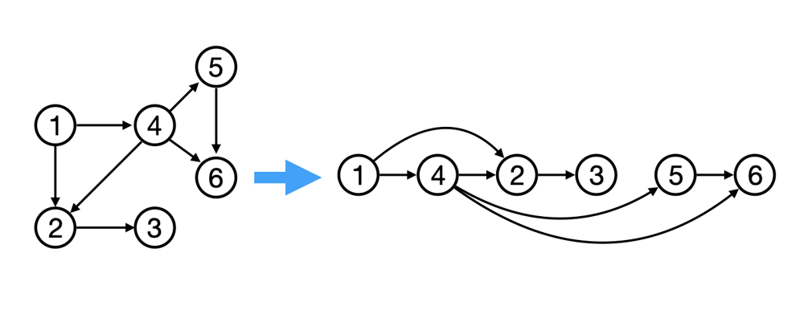

# 算法学习过程

## 数组

| 题目链接                                                     | 代码                                                       | 说明                                                         | 刷题次数 |
| ------------------------------------------------------------ | ---------------------------------------------------------- | ------------------------------------------------------------ | -------- |
| [704. 二分查找](https://leetcode.cn/problems/binary-search)  | [search](array/binarysearch/search.py)                     |                                                              |          |
| [26. 删除有序数组中的重复项](https://leetcode.cn/problems/remove-duplicates-from-sorted-array/) |                                                            |                                                              |          |
| [80. 删除有序数组中的重复项 II](https://leetcode.cn/problems/remove-duplicates-from-sorted-array-ii/) |                                                            |                                                              |          |
| [169. 多数元素](https://leetcode.cn/problems/majority-element/) |                                                            | [多种解法](https://leetcode.cn/problems/majority-element/solutions/146074/duo-shu-yuan-su-by-leetcode-solution/?envType=study-plan-v2&envId=top-interview-150) |          |
| [121. 买卖股票的最佳时机](https://leetcode.cn/problems/best-time-to-buy-and-sell-stock/) |                                                            | 记录历史最小值，当前的减去其                                 |          |
| [122. 买卖股票的最佳时机 II](https://leetcode.cn/problems/best-time-to-buy-and-sell-stock-ii/) |                                                            | 把所有递增的买上就行                                         |          |
| [125. 验证回文串](https://leetcode.cn/problems/valid-palindrome/) |                                                            | 双指针                                                       |          |
| [274. H 指数](https://leetcode.cn/problems/h-index/)         |                                                            |                                                              |          |
| [13. 罗马数字转整数](https://leetcode.cn/problems/roman-to-integer/) | [romanToInt](python/array/romanToInt.py)                   | 如果 *x* 的数值小于 *y* 的数值，那么 *x* 的数值要取相反数， 使用`from itertools import pairwise` |          |
| [12. 整数转罗马数字](https://leetcode.cn/problems/integer-to-roman/) | [intToRoman](python/array/intToRoman.py)                   | `while(num >= value): num -= value result += symbol`，一直减即可 |          |
| [380. O(1) 时间插入、删除和获取随机元素](https://leetcode.cn/problems/insert-delete-getrandom-o1/) | [RandomizedSet](python/array/RandomizedSet.py)             | 使用一个数组加一个字典，删除的时候最后一个元素顶替删掉元素，更新下标字典，random.choice(nums)随机返回一个元素 |          |
| [14. 最长公共前缀](https://leetcode.cn/problems/longest-common-prefix/) | [longestCommonPrefix](python/array/longestCommonPrefix.py) | 两两比较即可                                                 |          |
| [151. 反转字符串中的单词](https://leetcode.cn/problems/reverse-words-in-a-string/) | [reverseWords](python/array/reverseWords.py)               | 直接用python API：`s.strip(), s.split(), s.reverse()`        |          |
| [6. Z 字形变换](https://leetcode.cn/problems/zigzag-conversion/) | [convert](python/array/convert.py)                         | 分成mode0和mode1构造，注意numColumn=1和2的特殊情况           |          |
|                                                              |                                                            |                                                              |          |


## 二分查找

| 题目链接                                                     | 代码                                                         | 说明                                           | 刷题次数 |
| ------------------------------------------------------------ | ------------------------------------------------------------ | ---------------------------------------------- | -------- |
| [704. 二分查找](https://leetcode.cn/problems/binary-search)  | [search](array/binarysearch/search.py)                       |                                                | 2        |
| [35. 搜索插入位置](https://leetcode.cn/problems/search-insert-position/) | [searchInsert](python/array/binarysearch/searchInsert.py)    | `return left;`                                 | 2        |
| [34. 在排序数组中查找元素的第一个和最后一个位置](https://leetcode.cn/problems/find-first-and-last-position-of-element-in-sorted-array/) | [searchRange](python/array/binarysearch/searchRange.py)      | 两遍二分查找，分别找到最左边和最右边的target位 | 2        |
| [69. x 的平方根 ](https://leetcode.cn/problems/sqrtx/)       | [mySqrt](python/array/binarysearch/mySqrt.py)                | `(long) mid * mid`                             | 2        |
| [367. 有效的完全平方数](https://leetcode.cn/problems/valid-perfect-square/) | [isPerfectSquare](python/array/binarysearch/isPerfectSquare.py) | 同上                                           | 2        |
| [33. 搜索旋转排序数组](https://leetcode.cn/problems/search-in-rotated-sorted-array/) | [searchRotate](python/array/binarysearch/rotate)             | 区分是否在同一个递增段，用nums[-1]作区分点     |          |
| [81. 搜索旋转排序数组 II](https://leetcode.cn/problems/search-in-rotated-sorted-array-ii/) | [searchRotate2](python/array/binarysearch/rotate/search2.py) | 先去重，恢复二段性                             |          |
| [74. 搜索二维矩阵](https://leetcode.cn/problems/search-a-2d-matrix/) | [searchMatrix](src/array/binarysearch/searchMatrix/Solution.java) | `i = mid/m, j = mid%m`                         |          |
| [153. 寻找旋转排序数组中的最小值](https://leetcode.cn/problems/find-minimum-in-rotated-sorted-array/) | [findMin](python/array/binarysearch/rotate/findMin.py)<br />【虾皮】【蔚来】 | 和`nums[n-1]`对比                              |          |
| [240. 搜索二维矩阵 II](https://leetcode.cn/problems/search-a-2d-matrix-ii/) |                                                              |                                                |          |


## 链表

| 题目链接                                                     | 代码                                                         | 说明                                                         | 刷题次数 |
| ------------------------------------------------------------ | ------------------------------------------------------------ | ------------------------------------------------------------ | -------- |
| [203. 移除链表元素](https://leetcode.cn/problems/remove-linked-list-elements/) | [removenode](python/linkedlist/removeElements.py)            |                                                              | 3        |
| [160. 相交链表](https://leetcode.cn/problems/intersection-of-two-linked-lists/) | [getintersectionnode](python/linkedlist/getIntersectionNode.py) | 解法1:  哈希集合<br />解法2: 长对齐+双指针                   | 2        |
| [707. 设计链表](https://leetcode.cn/problems/design-linked-list/) | [designlinkedlist](src/linkedlist/designlinkedlist)          |                                                              | 2        |
| [206. 反转链表](https://leetcode.cn/problems/reverse-linked-list/) | [reverselist](python/linkedlist/reverseList.py)              | 使用`prev`和`cur`双指针<br />==多做几遍==                    | 3        |
| [92. 反转链表 II](https://leetcode.cn/problems/reverse-linked-list-ii/) | [reverseBetween](python/linkedlist/reverseBetween.py)        | t.next.next = cur, t.next = prev                             | 1        |
| [234. 回文链表](https://leetcode.cn/problems/palindrome-linked-list/) | [isPalindrome](python/linkedlist/isPalindrome.py)            | 空间复杂度为$O(1)$的做法：反转后一半，再和前一半逐一比较<br />==字节考过== | 2        |
| [141. 环形链表](https://leetcode.cn/problems/linked-list-cycle/) | [hasCycle](python/linkedlist/hasCycle.py)                    | 快慢指针一起走，最后能遇到说明就有环                         | 2        |
| [142. 环形链表 II](https://leetcode.cn/problems/linked-list-cycle-ii/) | [detectCycle](src/linkedlist/detectCycle/Solution.java)      | 两个指针，从头结点和相遇结点，各走一步，直到相遇，相遇点即为环入口 | 2        |
| [21. 合并两个有序链表](https://leetcode.cn/problems/merge-two-sorted-lists/) | [mergeTwoLists](src/linkedlist/mergeTwoLists/Solution.java)  | ==腾讯面试原题==<br />1、递归法: list1.next = merge(list1.next, list2) list2.next = merge(list1, list2.next)<br />2、迭代法: 设置虚拟节点dummy | 1        |
| [2. 两数相加](https://leetcode.cn/problems/add-two-numbers/) | [addTwoNumbers](src/linkedlist/addTwoNumbers/Solution.java)  | ==注意进位==                                                 | 1        |
| [19. 删除链表的倒数第 N 个结点](https://leetcode.cn/problems/remove-nth-node-from-end-of-list/) | [removeNthFromEnd](src/linkedlist/removeNthFromEnd/Solution.java) | 虚拟头节点+快慢指针，快指针一直走，满指针等n减少为0再走，这样快指针到达尾时慢指针到达了倒数第n | 2        |
| [24. 两两交换链表中的节点](https://leetcode.cn/problems/swap-nodes-in-pairs/) | [swappairs](src/linkedlist/swappairs/Solution.java)          | 设置虚拟头节点                                               | 2        |
| [138. 随机链表的复制](https://leetcode.cn/problems/copy-list-with-random-pointer/) |                                                              | 1、哈希表记录<br />2、链表拼接与拆分                         |          |
| [147. 对链表进行插入排序](https://leetcode.cn/problems/insertion-sort-list/) | [insertionSortList](src/linkedlist/insertionSortList/Solution.java) | 设置dummy，方便插入head之前                                  |          |
| [148. 排序链表](https://leetcode.cn/problems/sort-list/)     | [sortList](src/linkedlist/sortList/Solution.java)            | 归并排序+合并两个有序链表，递归比较好理解，但是空间复杂度比较高。==比较有价值== |          |
| [146. LRU 缓存](https://leetcode.cn/problems/lru-cache/)     | [LRUCache](src/linkedlist/LRUCache/LRUCache.java)            | ==比较有价值==：哈希表+双向链表<br />虚拟头节点+虚拟尾节点，put时放入头，超出容量删除尾 |          |
| [25. K 个一组翻转链表](https://leetcode.cn/problems/reverse-nodes-in-k-group/) | [reverseKGroup](src/linkedlist/reverseKGroup/Solution.java)  | ==困难==，和反转链表类似，注意需要拼接                       |          |
|                                                              |                                                              |                                                              |          |
|                                                              |                                                              |                                                              |          |
|                                                              |                                                              |                                                              |          |

## 滑动窗口

 


## 双指针

分享丨【算法题单】滑动窗口与双指针（定长/不定长/单序列/双序列/三指针/分组循环）
https://leetcode.cn/discuss/post/3578981/ti-dan-hua-dong-chuang-kou-ding-chang-bu-rzz7/

| 题目链接                                                     | 代码                                           | 说明                                                         | 刷题次数 |
| ------------------------------------------------------------ | ---------------------------------------------- | ------------------------------------------------------------ | -------- |
| [283. 移动零](https://leetcode.cn/problems/move-zeroes/)     | [moveZeroes](python/twopointers/moveZeroes.py) |                                                              | 3        |
| [11. 盛最多水的容器](https://leetcode.cn/problems/container-with-most-water/) | [maxArea](python/twopointers/maxArea.py)       |                                                              | 2        |
| [15. 三数之和](https://leetcode.cn/problems/3sum/)           | [threeSum](python/twopointers/threeSum.py)     | `nums[i],nums[left],nums[right]`<br />`nums[i] == nums[i-1]`<br />`nums[left]==nums[left+1]`<br />`nums[right]==nums[right-1]`去重 | 2        |
|                                                              |                                                |                                                              |          |
|                                                              |                                                |                                                              |          |


## 前缀和

解析：[前缀和](./notes/前缀和.md)

参考：[灵神](https://leetcode.cn/problems/range-sum-query-immutable/solutions/2693498/qian-zhui-he-ji-qi-kuo-zhan-fu-ti-dan-py-vaar/)

1. 如何计算数组元素到某个数的距离之和？见 [2602. 使数组元素全部相等的最少操作次数](https://leetcode.cn/problems/minimum-operations-to-make-all-array-elements-equal/description/)
2. 如何计算元素和等于 k 的子数组个数？见 [560. 和为 K 的子数组](https://leetcode.cn/problems/subarray-sum-equals-k/)
3. 把 nums 改成二维矩阵，如何计算子矩阵的元素和？[304. 二维区域和检索 - 矩阵不可变](https://leetcode.cn/problems/range-sum-query-2d-immutable/)
4. 如果可以修改 nums 的元素值呢？[307. 区域和检索 - 数组可修改](https://leetcode.cn/problems/range-sum-query-mutable/)
5. 对于[53. 最大子数组和](https://leetcode.cn/problems/maximum-subarray/)，除了 DP 做法外，还可以用 前缀和 解决。这一做法可以扩展到子数组长度有下限/上限，子数组元素和有上限等。

| 题目链接                                                     | 代码                                                   | 说明                                                         | 刷题次数 |
| ------------------------------------------------------------ | ------------------------------------------------------ | ------------------------------------------------------------ | -------- |
| [303. 区域和检索 - 数组不可变](https://leetcode.cn/problems/range-sum-query-immutable/) | [NumArray](src/prefixsum/NumArray/NumArray.java)       | `num[i,j] = prefixSum[j+1]-prefixSum[i]`                     |          |
| [560. 和为 K 的子数组](https://leetcode.cn/problems/subarray-sum-equals-k/) | [subarraySum](src/prefixsum/subarraySum/Solution.java) | 用哈希表记录前缀和的个数，就能 O(1) 算出左边有多少个 `s[j]−k`。<br />==数组不是单调的话，不要用滑动窗口，考虑用前缀和== |          |
| [437. 路径总和 III](https://leetcode.cn/problems/path-sum-iii/) | [pathSum](src/tree/pathSum2/Solution.java)             | 前缀和+哈希表                                                |          |
|                                                              |                                                        |                                                              |          |
|                                                              |                                                        |                                                              |          |


## 堆

优先队列的原理：https://yijunquan.blog.csdn.net/article/details/122801686

| 题目链接                                                     | 代码                                                    | 说明                                                         | 刷题次数 |
| ------------------------------------------------------------ | ------------------------------------------------------- | ------------------------------------------------------------ | -------- |
| [215. 数组中的第K个最大元素](https://leetcode.cn/problems/kth-largest-element-in-an-array/) |                                                         | 第k大，用最小堆，第k小，用最大堆<br />建立一个长度为K的最小堆，每次插入一个新数只需要和头节点对比，大于就替换头节点并reheap，小于直接抛掉。循环一次后头节点就是第K大的数了<br />快排: $O(N),O(\log N)$<br />堆排序: $O(N\log N), O(\log N)$ |          |
|                                                              |                                                         |                                                              |          |
| [295. 数据流的中位数](https://leetcode.cn/problems/find-median-from-data-stream/) | [medianFinder](src/heap/medianFinder/MedianFinder.java) | 左边大顶堆，右边小顶堆，小的加左边，大的加右边，平衡俩堆数，新加就弹出，堆顶给对家，奇数取多的，偶数取除2. |          |


## 哈希表

| 题目链接                                                     | 代码                                                         | 说明                                                         | 刷题次数 |
| ------------------------------------------------------------ | ------------------------------------------------------------ | ------------------------------------------------------------ | -------- |
| [1. 两数之和](https://leetcode.cn/problems/two-sum/)         | [twoSum](python/hashtable/twoSum.py)                         |                                                              | 3        |
| [49. 字母异位词分组](https://leetcode.cn/problems/group-anagrams/) | [groupAnagrams](python/hashtable/groupAnagrams.py)           | 排序后的字符串作为键                                         | 3        |
| [128. 最长连续序列](https://leetcode.cn/problems/longest-consecutive-sequence/) | [longestConsecutive](python/hashtable/longestConsecutive.py) | 要在set中遍历，不然会超时                                    | 3        |
| [349. 两个数组的交集](https://leetcode.cn/problems/intersection-of-two-arrays/) | [intersection](python/hashtable/intersection.py)             |                                                              | 2        |
| [202. 快乐数](https://leetcode.cn/problems/happy-number/)    | [isHappy](python/hashtable/isHappy.py)                       | divmod 是一个非常方便的函数，可以同时获取商和余数，<br />避免了分别使用 // 和 % 的麻烦。 | 2        |
| [454. 四数相加 II](https://leetcode.cn/problems/4sum-ii/)    | [fourSumCount](python/hashtable/fourSumCount.py)             | 两个循环求dict，另外两个循环判断存在性，$O(n^2)$             | 2        |
| [383. 赎金信](https://leetcode.cn/problems/ransom-note/)     | [canConstruct](python/hashtable/canConstruct.py)             |                                                              | 2        |
| [18. 四数之和](https://leetcode.cn/problems/4sum/)           | [fourSum](python/hashtable/fourSum.py)                       | $O(n^4)$ —> $O(n^3)$                                         | 2        |
| [15. 三数之和](https://leetcode.cn/problems/3sum/)           | [threeSum](python/hashtable/threeSum.py)                     |                                                              | 2        |
| [290. 单词规律](https://leetcode.cn/problems/word-pattern/)  | [wordPattern](python/hashtable/wordPattern.py)               | `word_dict[ch] = word ch_dict[word] = ch`                    | 1        |
|                                                              |                                                              |                                                              |          |
|                                                              |                                                              |                                                              |          |
|                                                              |                                                              |                                                              |          |
|                                                              |                                                              |                                                              |          |


## 栈和队列

[python中的栈和队列](./notes/python中的栈和队列.md)

| 题目链接                                                     | 实现代码                                        | 说明                                                         | 刷题次数 |
| ------------------------------------------------------------ | ----------------------------------------------- | ------------------------------------------------------------ | -------- |
| [232. 用栈实现队列](https://leetcode.cn/problems/implement-queue-using-stacks/) | [stack2queue](python/stackqueue/stack2queue.py) | 出队: outstack为空的时候将instack的元素pop到outstack，再outstack pop | 2        |
| [225. 用队列实现栈](https://leetcode.cn/problems/implement-stack-using-queues/) |                                                 | 两个队列: 一个负责备份，popleft完n-1以后倒回去<br />一个队列: 一边popleft一边append |          |

### 栈的应用

| 题目链接                                                     | 实现代码                                                     | 说明                                                         | 刷题次数 |
| ------------------------------------------------------------ | ------------------------------------------------------------ | ------------------------------------------------------------ | -------- |
| [20. 有效的括号](https://leetcode.cn/problems/valid-parentheses/) | [isValid](python/stackqueue/isValid.py)                      |                                                              | 2        |
| [1047. 删除字符串中的所有相邻重复项](https://leetcode.cn/problems/remove-all-adjacent-duplicates-in-string/) | [removeDuplicates](python/stackqueue/removeDuplicates.py)    |                                                              | 2        |
| [150. 逆波兰表达式求值](https://leetcode.cn/problems/evaluate-reverse-polish-notation/) | [evalRPN](python/stackqueue/evalRPN.py)                      | python可以使用dict+operator来简化代码，多看看代码            | 2        |
| [394. 字符串解码](https://leetcode.cn/problems/decode-string/) | [decodeString](python/stackqueue/decodeString.py)            | c.isdigit()判断数字<br />c.alpha()判读字母<br />`k = k * 10 + int(c)` | 2        |
| [32. 最长有效括号](https://leetcode.cn/problems/longest-valid-parentheses/) | [longestValidParentheses](python/stackqueue/longestValidParentheses.py) | 索引栈                                                       |          |


### 单调栈

[灵神单调栈题单](https://leetcode.cn/discuss/post/3579480/ti-dan-dan-diao-zhan-ju-xing-xi-lie-zi-d-u4hk/)

单调栈本质上是 **维护数组中的元素为单调序列**，数组中的元素 **要么** 符合单调性顺利进栈，**要么** 不符合单调性而将栈中其他元素“挤走”再进栈，使得栈中序列始终满足单调性。

理解这一点很重要，我们以单调递增栈为例，如果出现了比栈顶元素 **小** 的值，即不符合当前栈中序列单增特性的值，那么它会使所有比它大的值出栈，而 **该值便是接下来要连续出栈元素右侧最近的小值**，比该值大的栈元素都出栈完毕后，该值进栈，使得栈中的序列仍然满足单调递增。

如果题目有 **在连续序列中找元素左/右侧最近的大/小值** 的特点，我们就可以使用单调栈来求解，找最近的小值的单调递增栈模板如下，注意入栈的是数组元素的 **索引** 而不是元素值。

```java
Stack<Integer> stack = new Stack<>();

for (int i = 0; i < nums.length; i++) {
    while (!stack.isEmpty() && nums[i] < nums[stack.peek()]) {
        int index = stack.pop();
        
        // 关于 index 的特殊处理
        process();
    }
    // 索引入栈
    stack.push(i);
    
    // 处理逻辑
    process1();
}

```

> 链接：https://juejin.cn/post/7282007210430480418

| 题目链接                                               | 代码                                                   | 说明 | 刷题次数 |
|----------------------------------------------------|------------------------------------------------------| ---- | ---- |
| [155. 最小栈](https://leetcode.cn/problems/min-stack/) | [MinStack](python/stackqueue/MinStack.py) | 两个栈，比较val和min_stack栈顶元素大小<br />`self.min_stack.append(min(val, self.min_stack[-1]))` | 2 |
| [1475. 商品折扣后的最终价格](https://leetcode.cn/problems/final-prices-with-a-special-discount-in-a-shop/) | [finalPrices](src/stackqueue/finalPrices/Solution.java) | 注意从后往前遍历 | 2 |
| [739. 每日温度](https://leetcode.cn/problems/daily-temperatures/) | [dailyTemperatures](python/stackqueue/dandiaostack/dailyTemperatures.py) | 从前往后，从后往前都可以，注意等于号 | 3 |
| [496. 下一个更大元素 I](https://leetcode.cn/problems/next-greater-element-i/) | [nextGreaterElement](python/stackqueue/dandiaostack/nextGreaterElement.py) |      | 3 |
| [503. 下一个更大元素 II](https://leetcode.cn/problems/next-greater-element-ii/) |[nextGreaterElements](python/stackqueue/dandiaostack/nextGreaterElements.py)|用取模代替数组复制|3|
| [901. 股票价格跨度](https://leetcode.cn/problems/online-stock-span/) |[StockSpanner](src/stackqueue/StockSpanner/StockSpanner.java)|递减栈，先插入一个`(-1, math.inf)`|3|
| [42. 接雨水](https://leetcode.cn/problems/trapping-rain-water/) |[trap](python/stackqueue/dandiaostack/trap.py)|单调递减栈，注意bottom_h =  height[st.pop()]<br />`(min(height[left], h)-bottom_h)*(i-left-1)`<br />另外还有双指针和前缀和的解法，前缀和最简单|1|
| [84. 柱状图中最大的矩形](https://leetcode.cn/problems/largest-rectangle-in-histogram/) |[largestRectangleArea](python/stackqueue/dandiaostack/largestRectangleArea.py)|`left = [-1] * n`<br />`right = [n] * n`<br />三次遍历|1·|


- 单调栈适合解决与索引相关的问题，如求下一个更大/更小的元素。
- 单调队列适合解决与区间相关的问题，如滑动窗口问题。

### 单调队列

[灵神解析](https://leetcode.cn/problems/sliding-window-maximum/solutions/2499715/shi-pin-yi-ge-shi-pin-miao-dong-dan-diao-ezj6)

单调队列套路(双端队列)

1. 入（元素进入**队尾**，同时维护队列**单调性**）
2. 出（元素离开**队首**）
3. 记录/维护答案（根据**队首**）

| 题目链接                                                     | 实现代码                                                     | 说明                                      | 刷题次数 |
| ------------------------------------------------------------ | ------------------------------------------------------------ | ----------------------------------------- | -------- |
| [239. 滑动窗口最大值](https://leetcode.cn/problems/sliding-window-maximum/) | [maxSlidingWindow](python/stackqueue/dandiaoqueue/maxSlidingWindow.py) | 队首已经出去了：`i - q[0] + 1 > k`        | 2        |
| [LCR 184. 设计自助结算系统](https://leetcode.cn/problems/dui-lie-de-zui-da-zhi-lcof/) | [checkout](src/stackqueue/checkout/Checkout.java)            | `if ans == self.q2[0]: self.q2.popleft()` | 2        |
| [1438. 绝对差不超过限制的最长连续子数组](https://leetcode.cn/problems/longest-continuous-subarray-with-absolute-diff-less-than-or-equal-to-limit/) | [maxSubarray](src/stackqueue/longestSubarray/Solution.java)  | 两个单调队列+最大滑动窗口                 |          |

### 滑动窗口

#### 固定长度

套路：入-更新-出。

1. 入：下标为 i 的元素进入窗口，更新相关统计量。如果 i<k−1 则重复第一步。
2. 更新：更新答案。一般是更新最大值/最小值。
3. 出：下标为 i−k+1 的元素离开窗口，更新相关统计量。

| 题目链接                                                     | 实现代码                                                     | 说明                                                         | 刷题次数 |
| ------------------------------------------------------------ | ------------------------------------------------------------ | ------------------------------------------------------------ | -------- |
| [1456. 定长子串中元音的最大数目](https://leetcode.cn/problems/maximum-number-of-vowels-in-a-substring-of-given-length/) | [maxVowels](python/stackqueue/dandiaoqueue/maxVowels.py)     | ==板子题目==                                                 |          |
| [643. 子数组最大平均数 I](https://leetcode.cn/problems/maximum-average-subarray-i/) | [findMaxAverage](python/stackqueue/dandiaoqueue/findMaxAverage.py) |                                                              |          |
|                                                              |                                                              | 本题维护长为 $n$ 的子串 $s'$ 的每种字母的出现次数。如果 $s'$ 的每种字母的出现次数，和 $p$ 的每种字母的出现次数都相同，那么 $s'$ 是 $p$ 的异位词，把 $s'$ 左端点下标加入答案。 |          |
|                                                              |                                                              |                                                              |          |
|                                                              |                                                              |                                                              |          |


## 二叉树

==关键要从二叉树中学习到递归==。

[博客](https://yijunquan.blog.csdn.net/article/details/120389824?fromshare=blogdetail&sharetype=blogdetail&sharerId=120389824&sharerefer=PC&sharesource=weixin_47692652&sharefrom=from_link)

递归三要素：

1. **确定递归函数的参数和返回值：** 确定哪些参数是递归的过程中需要处理的，那么就在递归函数里加上这个参数， 并且还要明确每次递归的返回值是什么进而确定递归函数的返回类型。
2. **确定终止条件：** 写完了递归算法, 运行的时候，经常会遇到栈溢出的错误，就是没写终止条件或者终止条件写的不对，操作系统也是用一个栈的结构来保存每一层递归的信息，如果递归没有终止，操作系统的内存栈必然就会溢出。
3. **确定单层递归的逻辑：** 确定每一层递归需要处理的信息。在这里也就会重复调用自己来实现递归的过程。


### 二叉树的遍历

| 题目链接                                                     | 实现代码                                                     | 说明                                     | 刷题次数 |
| ------------------------------------------------------------ | ------------------------------------------------------------ | ---------------------------------------- | -------- |
| [144. 二叉树的前序遍历](https://leetcode.cn/problems/binary-tree-preorder-traversal/) | [preorderTraversal](src/tree/traversal/preorderTraversal/Solution.java) | 迭代法注意入栈顺序：中右左               | 2        |
| [94. 二叉树的中序遍历](https://leetcode.cn/problems/binary-tree-inorder-traversal/) | [inorderTraversal](src/tree/traversal/inorderTraversal/Solution.java) | 迭代法和前序遍历不一样，放的是node       | 2        |
| [145. 二叉树的后序遍历](https://leetcode.cn/problems/binary-tree-postorder-traversal/) | [postorderTraversal](src/tree/traversal/postorderTraversal/Solution.java) | 迭代法修改前序遍历的，中右左反转->左右中 | 2        |
| [102. 二叉树的层序遍历](https://leetcode.cn/problems/binary-tree-level-order-traversal/) | [levelOrder](src/tree/traversal/levelOrder/Solution.java)    |                                          | 2        |
| [107. 二叉树的层序遍历 II](https://leetcode.cn/problems/binary-tree-level-order-traversal-ii/) | [levelOrderBottom](src/tree/traversal/levelOrderBottom/Solution.java) | 逆序即可                                 | 2        |
| [199. 二叉树的右视图](https://leetcode.cn/problems/binary-tree-right-side-view/) | [rightSideView](src/tree/traversal/rightSideView/Solution.java) |                                          | 2        |
| [637. 二叉树的层平均值](https://leetcode.cn/problems/average-of-levels-in-binary-tree/) | [averageOfLevels](src/tree/traversal/averageOfLevels/Solution.java) |                                          |          |
| [429. N 叉树的层序遍历](https://leetcode.cn/problems/n-ary-tree-level-order-traversal/) | [levelOrder2](src/tree/traversal/levelOrder2/Solution.java)  |                                          |          |
| [515. 在每个树行中找最大值](https://leetcode.cn/problems/find-largest-value-in-each-tree-row/) | [largestValues](src/tree/traversal/largestValues/Solution.java) |                                          |          |
| [116. 填充每个节点的下一个右侧节点指针](https://leetcode.cn/problems/populating-next-right-pointers-in-each-node/) | [connect](src/tree/traversal/connect/Solution.java)          |                                          |          |
| [104. 二叉树的最大深度](https://leetcode.cn/problems/maximum-depth-of-binary-tree/) | [maxDepth](src/tree/traversal/maxDepth/Solution.java)        | 递归更好: `max(left, right) + 1`         | 2        |
| [111. 二叉树的最小深度](https://leetcode.cn/problems/minimum-depth-of-binary-tree/) | [minDepth](src/tree/traversal/minDepth/Solution.java)        | 层次遍历找到叶子结点                     | 2        |


### 二叉树的属性

| 题目链接                                                     | 实现代码                                                     | 说明                                                         | 刷题次数 |
| ------------------------------------------------------------ | ------------------------------------------------------------ | ------------------------------------------------------------ | -------- |
| [101. 对称二叉树](https://leetcode.cn/problems/symmetric-tree/) | [isSymmetric](src/tree/isSymmetric/Solution.java)            | 迭代法+递归法                                                |          |
| [559. N 叉树的最大深度](https://leetcode.cn/problems/maximum-depth-of-n-ary-tree/) | [maxDepth](src/tree/maxDepth/Solution.java)                  |                                                              |          |
| [222. 完全二叉树的节点个数](https://leetcode.cn/problems/count-complete-tree-nodes/) | [countNodes](src/tree/countNodes/Solution.java)              | 可以利用满二叉树来简化复杂度为$\log_n\log_n$；[解析](https://programmercarl.com/0222.%E5%AE%8C%E5%85%A8%E4%BA%8C%E5%8F%89%E6%A0%91%E7%9A%84%E8%8A%82%E7%82%B9%E4%B8%AA%E6%95%B0.html#%E6%80%9D%E8%B7%AF) |          |
| [110. 平衡二叉树](https://leetcode.cn/problems/balanced-binary-tree/) | [isBalanced](src/tree/isBalanced/Solution.java)              |                                                              |          |
| [257. 二叉树的所有路径](https://leetcode.cn/problems/binary-tree-paths/) | [binaryTreePaths](src/tree/binaryTreePaths/Solution.java)    |                                                              |          |
| [404. 左叶子之和](https://leetcode.cn/problems/sum-of-left-leaves/) | [sumOfLeftLeaves](src/tree/sumOfLeftLeaves/Solution.java)    | 递归                                                         |          |
| [513. 找树左下角的值](https://leetcode.cn/problems/find-bottom-left-tree-value/) | [findBottomLeftValue](src/tree/findBottomLeftValue/Solution.java) | 迭代法(层序遍历) +递归法                                     |          |
| [112. 路径总和](https://leetcode.cn/problems/path-sum/)      | [hasPathSum](src/tree/hasPathSum/Solution.java)              |                                                              |          |
| [113. 路径总和 II](https://leetcode.cn/problems/path-sum-ii/) | [pathsum](src/tree/pathsum/Solution.java)                    |                                                              |          |
| [437. 路径总和 III](https://leetcode.cn/problems/path-sum-iii/) | [pathSum](src/tree/pathSum2/Solution.java)                   | 前缀和+哈希表                                                |          |
| [543. 二叉树的直径](https://leetcode.cn/problems/diameter-of-binary-tree/) | [diameterOfBinaryTree](src/tree/diameterOfBinaryTree/Solution.java) | 记录每个节点左子树的深度+右子树的深度                        |          |
| [208. 实现 Trie (前缀树)](https://leetcode.cn/problems/implement-trie-prefix-tree/) | [Trie](python/tree/Trie.py)                                  | 26叉树                                                       |          |
|                                                              |                                                              |                                                              |          |
|                                                              |                                                              |                                                              |          |


### 二叉树的修改与创建

| 题目链接                                                     | 实现代码                                                     | 说明                                                         | 刷题次数 |
| ------------------------------------------------------------ | ------------------------------------------------------------ | ------------------------------------------------------------ | -------- |
| [106. 从中序与后序遍历序列构造二叉树](https://leetcode.cn/problems/construct-binary-tree-from-inorder-and-postorder-traversal/) | [buildtree](src/tree/buildTree/Solution.java)                | 比较难：[思路1](https://programmercarl.com/0106.%E4%BB%8E%E4%B8%AD%E5%BA%8F%E4%B8%8E%E5%90%8E%E5%BA%8F%E9%81%8D%E5%8E%86%E5%BA%8F%E5%88%97%E6%9E%84%E9%80%A0%E4%BA%8C%E5%8F%89%E6%A0%91.html#%E7%AE%97%E6%B3%95%E5%85%AC%E5%BC%80%E8%AF%BE)、[思路2](https://leetcode.cn/problems/construct-binary-tree-from-inorder-and-postorder-traversal/solutions/426738/cong-zhong-xu-yu-hou-xu-bian-li-xu-lie-gou-zao-14/) |          |
| [105. 从前序与中序遍历序列构造二叉树](https://leetcode.cn/problems/construct-binary-tree-from-preorder-and-inorder-traversal/) | [buildtree2](src/tree/buildtree2/Solution.java)              | 跟106差不多                                                  |          |
| [654. 最大二叉树](https://leetcode.cn/problems/maximum-binary-tree/) | [constructMaximumBinaryTree](src/tree/constructMaximumBinaryTree/Solution.java) | 尽量在原数组上操作                                           |          |
| ==[114. 二叉树展开为链表](https://leetcode.cn/problems/flatten-binary-tree-to-linked-list/)== | [flatten](src/tree/flatten/Solution.java)                    |                                                              |          |
| [226. 翻转二叉树](https://leetcode.cn/problems/invert-binary-tree/) | [invertTree](src/tree/invertTree/Solution.java)              |                                                              |          |
| [617. 合并二叉树](https://leetcode.cn/problems/merge-two-binary-trees/) | [mergeTrees](src/tree/mergeTrees/Solution.java)              |                                                              |          |
|                                                              |                                                              |                                                              |          |

106步骤：

> - 第一步：如果数组大小为零的话，说明是空节点了。
> - 第二步：如果不为空，那么取后序数组最后一个元素作为节点元素。
> - 第三步：找到后序数组最后一个元素在中序数组的位置，作为切割点
> - 第四步：切割中序数组，切成中序左数组和中序右数组 （顺序别搞反了，一定是先切中序数组）
> - 第五步：切割后序数组，切成后序左数组和后序右数组
> - 第六步：递归处理左区间和右区间


### 最近公共祖先

| 题目链接                                                     | 实现代码                                                     | 说明         |
| ------------------------------------------------------------ | ------------------------------------------------------------ | ------------ |
| [236. 二叉树的最近公共祖先](https://leetcode.cn/problems/lowest-common-ancestor-of-a-binary-tree/) | [lowestCommonAncestor](src/tree/lca/lowestCommonAncestor/Solution.java) | 后序遍历     |
| [235. 二叉搜索树的最近公共祖先](https://leetcode.cn/problems/lowest-common-ancestor-of-a-binary-search-tree/) | [lowestCommonAncestor2](src/tree/lca/lowestCommonAncestor2/Solution.java) | 利用p<root<q |


### 二叉搜索树的属性 

| 题目链接                                                     | 实现代码                                                     | 说明                                                   | 刷题次数 |
| ------------------------------------------------------------ | ------------------------------------------------------------ | ------------------------------------------------------ | -------- |
| [700. 二叉搜索树中的搜索](https://leetcode.cn/problems/search-in-a-binary-search-tree/) | [searchBST](src/tree/bst/searchBST/Solution.java)            |                                                        |          |
| [98. 验证二叉搜索树](https://leetcode.cn/problems/validate-binary-search-tree/) | [isValidBST](src/tree/bst/isValidBST/Solution.java)          | ==中序遍历==下，输出的二叉搜索树节点的数值是有序序列。 |          |
| [530. 二叉搜索树的最小绝对差](https://leetcode.cn/problems/minimum-absolute-difference-in-bst/) | [getMinimumDifference](src/tree/bst/getMinimumDifference/Solution.java) | 同样利用中序遍历，和pre的节点值相减。                  |          |
| [501. 二叉搜索树中的众数](https://leetcode.cn/problems/find-mode-in-binary-search-tree/) | [findMode](src/tree/bst/findMode/Solution.java)              | 处理众数逻辑比较绕                                     |          |
| [538. 把二叉搜索树转换为累加树](https://leetcode.cn/problems/convert-bst-to-greater-tree/) | [convertBST](src/tree/bst/convertBST/Solution.java)          |                                                        |          |
| [230. 二叉搜索树中第 K 小的元素](https://leetcode.cn/problems/kth-smallest-element-in-a-bst/) | [kthSmallest](src/tree/kthSmallest/Solution.java)            |                                                        |          |

> 在二叉搜索树（BST）中，中序遍历的结果应该是一个严格递增的序列。这意味着在中序遍历过程中，每个节点的值都必须大于其前一个节点的值。如果在遍历过程中发现某个节点的值小于或等于其前一个节点的值，那么这棵树就不是二叉搜索树。
>
> ### 原因解释
>
> - **BST的性质**：在BST中，对于任意节点，其左子树中的所有节点值都小于该节点的值，其右子树中的所有节点值都大于该节点的值。因此，在中序遍历中，左子树的节点先于当前节点访问，右子树的节点后于当前节点访问。
> - **中序遍历顺序**：中序遍历的顺序是先访问左子树，然后访问当前节点，最后访问右子树。因此，当我们访问当前节点时，上一个访问的节点是其左子树中的最大值，而当前节点的值必须大于这个最大值。
> - **严格递增性**：如果当前节点的值小于或等于上一个节点的值，那么就违反了BST的性质，因为这意味着在中序遍历序列中出现了非严格递增的情况。
>
> ### 示例
>
> 假设我们有以下BST：
>
> ```text
>     5
>    / \
>   3   8
>  / \   \
> 2   4   9
> ```
>
> - 中序遍历的顺序是：2, 3, 4, 5, 8, 9。
> - 在遍历过程中，每次访问一个节点时，我们只需要检查它是否大于上一个访问的节点：
>   - 访问2时，没有前一个节点，继续。
>   - 访问3时，3 > 2，继续。
>   - 访问4时，4 > 3，继续。
>   - 访问5时，5 > 4，继续。
>   - 访问8时，8 > 5，继续。
>   - 访问9时，9 > 8，继续。
>
> 如果在任何一步中，当前节点的值小于或等于上一个节点的值，则该树不是BST。
>
> 因此，只需要验证当前节点的值是否大于上一个节点的值，就可以确保中序遍历结果是严格递增的，从而验证该树是二叉搜索树。


### 二叉搜索树的修改与创建

| 题目链接                                                     | 实现代码                                            | 说明                                                         |
| ------------------------------------------------------------ | --------------------------------------------------- | ------------------------------------------------------------ |
| [701. 二叉搜索树中的插入操作](https://leetcode.cn/problems/insert-into-a-binary-search-tree/) | [insert](src/tree/bst/insertIntoBST/Solution.java)  | 遍历二叉搜索树，找到空节点插入元素就可以                     |
| [450. 删除二叉搜索树中的节点](https://leetcode.cn/problems/delete-node-in-a-bst/) | [deleteNode](src/tree/bst/deleteNode/Solution.java) | 找到节点，将其替换为右子树的最小节点，然后删除右子树的最小节点 |
| [669. 修剪二叉搜索树](https://leetcode.cn/problems/trim-a-binary-search-tree/) | [trimBST](src/tree/bst/trimBST/Solution.java)       | [思路](https://programmercarl.com/0669.%E4%BF%AE%E5%89%AA%E4%BA%8C%E5%8F%89%E6%90%9C%E7%B4%A2%E6%A0%91.html#%E6%80%9D%E8%B7%AF) |
| [108. 将有序数组转换为二叉搜索树](https://leetcode.cn/problems/convert-sorted-array-to-binary-search-tree/) |                                                     | 递归即可，取中间的为根节点                                   |


## 回溯

[博客](https://programmercarl.com/%E5%9B%9E%E6%BA%AF%E7%AE%97%E6%B3%95%E7%90%86%E8%AE%BA%E5%9F%BA%E7%A1%80.html#%E7%90%86%E8%AE%BA%E5%9F%BA%E7%A1%80)


伪代码：

```c
void backtracking(参数) {
    if (终止条件) {
        存放结果;
        return;
    }

    for (选择：本层集合中元素（树中节点孩子的数量就是集合的大小）) {
        处理节点;
        backtracking(路径，选择列表); // 递归
        回溯，撤销处理结果
    }
}
```


### 组合

| 题目链接                                                     | 实现代码                                                     | 说明                                                     | 刷题次数 |
| ------------------------------------------------------------ | ------------------------------------------------------------ | -------------------------------------------------------- | -------- |
| [77. 组合](https://leetcode.cn/problems/combinations/)       | [combine](src/backtracking/combination/combine/Solution.java) | 剪枝：`i<=n-(k-path.size())+1`                           |          |
| [216. 组合总和 III](https://leetcode.cn/problems/combination-sum-iii/) | [combinationSum3](src/backtracking/combination/combinationSum3/Solution.java) | 剪枝：`upper = n < 9 ? n : 9`                            |          |
| [17. 电话号码的字母组合](https://leetcode.cn/problems/letter-combinations-of-a-phone-number/) | [letterCombinations](src/backtracking/combination/letterCombinations/Solution.java) |                                                          |          |
| [39. 组合总和](https://leetcode.cn/problems/combination-sum/) | [combinationSum]()                                           | 剪枝：`i < candidates.length && candidates[i] <= target` | 2        |
| [40. 组合总和 II](https://leetcode.cn/problems/combination-sum-ii/) | [combinationSum2](src/backtracking/combination/combinationSum2/Solution.java) | 去重：`used[i]=0表示树层使用过`                          |          |
|                                                              |                                                              |                                                          |          |

### 分割

| 题目链接                                                     | 实现代码                                                     | 说明                                   |
| ------------------------------------------------------------ | ------------------------------------------------------------ | -------------------------------------- |
| [131. 分割回文串](https://leetcode.cn/problems/palindrome-partitioning/) | [partition](src/backtracking/partition/Solution.java)        |                                        |
| [93. 复原 IP 地址](https://leetcode.cn/problems/restore-ip-addresses/) | [restoreIpAddresses](src/backtracking/partition/restoreIpAddresses/Solution.java) | 递归三层即可，剩下的直接进行合法性判断 |

### 子集

| 题目链接                                                | 实现代码                                                     | 说明           |
| ------------------------------------------------------- | ------------------------------------------------------------ | -------------- |
| [78. 子集](https://leetcode.cn/problems/subsets/)       | [subsets](src/backtracking/subsets/subsets/Solution.java)    |                |
| [90. 子集 II](https://leetcode.cn/problems/subsets-ii/) | [subsetsWithDup](src/backtracking/subsets/subsetsWithDup/Solution.java) | 去重：使用used |


### 排列

| 题目链接                                                     | 实现代码                                                     | 说明                                                         | 刷题次数 |
| ------------------------------------------------------------ | ------------------------------------------------------------ | ------------------------------------------------------------ | -------- |
| [46. 全排列](https://leetcode.cn/problems/permutations/)     | [permute](src/backtracking/permute/permute/Solution.java)    | 使用used判断哪些元素使用过了                                 | 2        |
| [47. 全排列 II](https://leetcode.cn/problems/permutations-ii/) | [permuteUnique](src/backtracking/permute/permuteUnique/Solution.java) | !used[i-1]: 树层去重更高效                                   |          |
| [22. 括号生成](https://leetcode.cn/problems/generate-parentheses/) | [generateParenthesis](src/backtracking/permute/generateParenthesis/Solution.java) | left > 0 可以使用左括号<br />left < right，才可以使用右。<br />left=right=0为结果。 | 2        |
|                                                              |                                                              |                                                              |          |


### 棋盘问题

| 题目链接                                                  | 实现代码                                                     | 说明 |
| --------------------------------------------------------- | ------------------------------------------------------------ | ---- |
| [51. N 皇后](https://leetcode.cn/problems/n-queens/)      | [solveNQueens](src/backtracking/chess/solveNQueens/Solution.java) |      |
| [37. 解数独](https://leetcode.cn/problems/sudoku-solver/) |                                                              |      |

### 其它

| 题目链接                                                     | 实现代码                                                  | 说明             |
| ------------------------------------------------------------ | --------------------------------------------------------- | ---------------- |
| [491. 非递减子序列](https://leetcode.cn/problems/non-decreasing-subsequences/) | [subsets](src/backtracking/subsets/subsets/Solution.java) | 去重逻辑有点特别 |
|                                                              | [exist](src/backtracking/exist/Solution.java)             | 注意减枝策略     |


## 贪心


### 简单题目

| 题目链接                                                     | 实现代码                                                     | 说明 |
| ------------------------------------------------------------ | ------------------------------------------------------------ | ---- |
| [455. 分发饼干](https://leetcode.cn/problems/assign-cookies/) | [findContentChildren](src/greedy/findContentChildren/Solution.java) |      |
| [1005. K 次取反后最大化的数组和](https://leetcode.cn/problems/maximize-sum-of-array-after-k-negations/) | [largestSumAfterKNegations](src/greedy/largestSumAfterKNegations/Solution.java) |      |


### 序列问题

| 题目链接                                                     | 实现代码                                                     | 说明                     |
| ------------------------------------------------------------ | ------------------------------------------------------------ | ------------------------ |
| [376. 摆动序列](https://leetcode.cn/problems/wiggle-subsequence/) | [wiggleMaxLength](src/greedy/wiggleMaxLength/Solution.java)  | 统计上升下降有多少次即可 |
| [738. 单调递增的数字](https://leetcode.cn/problems/monotone-increasing-digits/) | [monotoneIncreasingDigits](src/greedy/monotoneIncreasingDigits/Solution.java) | 注意使用`nineFlag`       |


### 区间问题

| 题目链接                                                     | 实现代码                                                     | 说明       |
| ------------------------------------------------------------ | ------------------------------------------------------------ | ---------- |
| [55. 跳跃游戏](https://leetcode.cn/problems/jump-game/)      | [canJump](src/greedy/canJump/Solution.java)                  |            |
| [45. 跳跃游戏 II](https://leetcode.cn/problems/jump-game-ii/) | [jump](src/greedy/jump/Solution.java)                        |            |
| [134. 加油站](https://leetcode.cn/problems/gas-station/)     | [canCompleteCircuit](src/greedy/canCompleteCircuit/Solution.java) |            |
| [452. 用最少数量的箭引爆气球](https://leetcode.cn/problems/minimum-number-of-arrows-to-burst-balloons/) | [findMinArrowShots](src/greedy/findMinArrowShots/Solution.java) | 最小右边界 |
| [435. 无重叠区间](https://leetcode.cn/problems/non-overlapping-intervals/) | [eraseOverlapIntervals](src/greedy/eraseOverlapIntervals/Solution.java) |            |
| [763. 划分字母区间](https://leetcode.cn/problems/partition-labels/) | [partitionLabels](src/greedy/partitionLabels/Solution.java)  |            |
| [56. 合并区间](https://leetcode.cn/problems/merge-intervals/) | [merge](src/greedy/merge/Solution.java)                      |            |


### 其他题目

| 题目链接                                                     | 实现代码                                                     | 说明                                        |
| ------------------------------------------------------------ | ------------------------------------------------------------ | ------------------------------------------- |
| [135. 分发糖果](https://leetcode.cn/problems/candy/)         | [candy](src/greedy/candy/Solution.java)                      | 两次遍历                                    |
| [406. 根据身高重建队列](https://leetcode.cn/problems/queue-reconstruction-by-height/) | [reconstructQueue](src/greedy/reconstructQueue/Solution.java) | 身高从大到小排列，k从小到大插入，linkedlist |


## 动态规划

动态规划五步骤

1. 确定dp数组（dp table）以及下标的含义
2. 确定递推公式
3. dp数组如何初始化
4. 确定遍历顺序
5. 举例推导dp数组

### 基础题目

| 题目链接                                                     | 实现代码                                                     | 说明                              | 刷题次数 |
| ------------------------------------------------------------ | ------------------------------------------------------------ | --------------------------------- | -------- |
| [509. 斐波那契数](https://leetcode.cn/problems/fibonacci-number/) | [fib](src/dp/basic/fib/Solution.java)                        |                                   | 2        |
| [1137. 第 N 个泰波那契数](https://leetcode.cn/problems/n-th-tribonacci-number/) |                                                              |                                   | 1        |
| [70. 爬楼梯](https://leetcode.cn/problems/climbing-stairs/)  | [climbStairs](src/dp/basic/climbStairs/Solution.java)        |                                   | 2        |
| [746. 使用最小花费爬楼梯](https://leetcode.cn/problems/min-cost-climbing-stairs/) | [minCostClimbingStairs](src/dp/basic/minCostClimbingStairs/Solution.java) |                                   | 2        |
| [62. 不同路径](https://leetcode.cn/problems/unique-paths/)   | [uniquePaths](src/dp/basic/uniquePaths/Solution.java)        |                                   |          |
| [63. 不同路径 II](https://leetcode.cn/problems/unique-paths-ii/) | [uniquePathsWithObstacles](src/dp/basic/uniquePathsWithObstacles/Solution.java) |                                   |          |
| [343. 整数拆分](https://leetcode.cn/problems/integer-break/) |                                                              |                                   |          |
| [96. 不同的二叉搜索树](https://leetcode.cn/problems/unique-binary-search-trees/) | [numTrees](src/dp/basic/numTrees/Solution.java)              | `dp[i] += dp[j - 1] * dp[i - j];` |          |
|                                                              |                                                              |                                   |          |

### 背包问题

#### 0-1背包

| 题目链接                                                     | 实现代码                                                     | 说明                                                         | 刷题次数 |
| ------------------------------------------------------------ | ------------------------------------------------------------ | ------------------------------------------------------------ | -------- |
| [416. 分割等和子集](https://leetcode.cn/problems/partition-equal-subset-sum/) | [canPartition](src/dp/backpack/onezero/canPartition/Solution.java) | 物品是`nums[i]`，重量是`nums[i]`，价值也是`nums[i]`，背包体积是`sum/2`。 | 2        |
| [1049. 最后一块石头的重量 II](https://leetcode.cn/problems/last-stone-weight-ii/) | [lastStoneWeightII](src/dp/backpack/onezero/lastStoneWeightII/Solution.java) | 尽可能分成两半，`sum - 2 * dp[target]`                       | 2        |
| [494. 目标和](https://leetcode.cn/problems/target-sum/)      | [findTargetSumWays](src/dp/backpack/onezero/findTargetSumWays/Solution.java) | 物品是`nums[i]`，重量是`nums[i]`，价值也是`nums[i]`，背包体积是`sum-target/2`。<br />`dp[j] += dp[j - nums[i]];` | 2        |
| [474. 一和零](https://leetcode.cn/problems/ones-and-zeroes/) | [findMaxForm](src/dp/backpack/onezero/findMaxForm/Solution.java) | 两个维度: `dp[i][j] = max(dp[i][j], dp[i - zeroNum][j - oneNum] + 1);` | 2        |
|                                                              |                                                              |                                                              |          |

#### 完全背包

一维dp：内循环正序

| 题目链接                                                     | 实现代码                                                     | 说明                                                         | 刷题次数 |
| ------------------------------------------------------------ | ------------------------------------------------------------ | ------------------------------------------------------------ | -------- |
| [518. 零钱兑换 II](https://leetcode.cn/problems/coin-change-ii/) | [change2](src/dp/backpack/complete/change2/Solution.java)    | 组合问题，先遍历物品，再遍历背包<br />`dp[j] = dp[j] + dp[j-coins[i]]` | 2        |
| [377. 组合总和 Ⅳ](https://leetcode.cn/problems/combination-sum-iv/) | [combinationSum4](dp/backpack/complete/combinationSum4/Solution.java) | 排列问题，先遍历背包，再遍历物品                             | 2        |
| [322. 零钱兑换](https://leetcode.cn/problems/coin-change/)   | [change](src/dp/backpack/complete/change/Solution.java)      | 求的是最少数，遍历顺序无所谓<br />`dp[j] = Math.min(dp[j], dp[j-coins[i]] + 1)` | 2        |
| [279. 完全平方数](https://leetcode.cn/problems/perfect-squares/) | [numSquares](src/dp/backpack/complete/numSquares/Solution.java) | 同上                                                         | 2        |
| [139. 单词拆分](https://leetcode.cn/problems/word-break/)    | [wordBreak](src/dp/backpack/complete/wordBreak/Solution.java) | 排列问题，先遍历背包，再遍历物品<br />递推公式是 if([j, i] 这个区间的子串出现在字典里 && dp[j]是true) 那么 dp[i] = true。 | 2        |


### 打家劫舍

| 题目链接                                                     | 实现代码                                                  | 说明                                            |
| ------------------------------------------------------------ | --------------------------------------------------------- | ----------------------------------------------- |
| [198. 打家劫舍](https://leetcode.cn/problems/house-robber/)  | [rob](src/dp/rob/rob/Solution.java)                       | `dp[i] = Math.max(dp[i-1], dp[i-2] + nums[i]);` |
| [213. 打家劫舍 II](https://leetcode.cn/problems/house-robber-ii/) | [rob2](src/dp/rob/rob2/Solution.java)                     | 两种情况：去掉第一个房子，去掉最后一个房子      |
| [337. 打家劫舍 III](https://leetcode.cn/problems/house-robber-iii/) | [rob3](src/dp/rob/rob3/Solution.java)                     | ==树形dp==                                      |
| [740. 删除并获得点数](https://leetcode.cn/problems/delete-and-earn/) | [deleteAndEarn](src/dp/basic/deleteAndEarn/Solution.java) |                                                 |


### 股票问题

| 题目链接                                                     | 实现代码                                                | 说明                                                         |
| ------------------------------------------------------------ | ------------------------------------------------------- | ------------------------------------------------------------ |
| [121. 买卖股票的最佳时机](https://leetcode.cn/problems/best-time-to-buy-and-sell-stock/) | [maxProfit1](src/dp/maxProfit/maxProfit/Solution.java)  | 买卖一次<br />`dp[i][0] = max(dp[i-1][0], -prices[i]); `<br />`dp[i][1] = max(dp[i-1][1], dp[i-1][0] + prices[i])` |
| [122. 买卖股票的最佳时机 II](https://leetcode.cn/problems/best-time-to-buy-and-sell-stock-ii/) | [maxProfit2](src/dp/maxProfit/maxProfit2/Solution.java) | 买卖多次<br />`dp[i][0] = max(dp[i-1][0], dp[i-1][1]-prices[i]); `<br />`dp[i][1] = max(dp[i-1][1], dp[i-1][0] + prices[i])` |
| [123. 买卖股票的最佳时机 III](https://leetcode.cn/problems/best-time-to-buy-and-sell-stock-iii/) | [maxProfit3](src/dp/maxProfit/maxProfit3/Solution.java) | 最多买卖两次，5个状态，==hard==                              |
| [123. 买卖股票的最佳时机 III](https://leetcode.cn/problems/best-time-to-buy-and-sell-stock-iii/) | [maxProfit4](src/dp/maxProfit/maxProfit4/Solution.java) | 最多买卖k次，(2k+1)个状态，==hard==                          |
| [309. 买卖股票的最佳时机含冷冻期](https://leetcode.cn/problems/best-time-to-buy-and-sell-stock-with-cooldown/) | [maxProfit5](src/dp/maxProfit/maxProfit5/Solution.java) | 四个状态看解析：[买入状态、卖出状态、今天卖出、冷冻状态](https://programmercarl.com/0309.%E6%9C%80%E4%BD%B3%E4%B9%B0%E5%8D%96%E8%82%A1%E7%A5%A8%E6%97%B6%E6%9C%BA%E5%90%AB%E5%86%B7%E5%86%BB%E6%9C%9F.html#%E6%80%9D%E8%B7%AF) |
| [714. 买卖股票的最佳时机含手续费](https://leetcode.cn/problems/best-time-to-buy-and-sell-stock-with-transaction-fee/) | [maxProfit6](src/dp/maxProfit/maxProfit6/Solution.java) | 每次卖出的时候减去手续费即可                                 |


### 序列问题

| 题目链接                                                     | 实现代码                                                     | 说明                                                         |
| ------------------------------------------------------------ | ------------------------------------------------------------ | ------------------------------------------------------------ |
| [300. 最长递增子序列](https://leetcode.cn/problems/longest-increasing-subsequence/) | [lengthOfLIS](src/dp/sequence/lengthOfLIS/Solution.java)     | $dp[i] = \max dp[j], 0\le j\le i\ \& \ nums[j]<nums[i]$$LIS_{length} = max(dp[i]),0\le i\le n$ |
| [674. 最长连续递增序列](https://leetcode.cn/problems/longest-continuous-increasing-subsequence/) | [findLengthOfLCIS](src/dp/sequence/findLengthOfLCIS/Solution.java) |                                                              |
| [718. 最长重复子数组](https://leetcode.cn/problems/maximum-length-of-repeated-subarray/) | [findLength](src/dp/sequence/findLength/Solution.java)       | $dp[i][j]$                                                   |
| [1143. 最长公共子序列](https://leetcode.cn/problems/longest-common-subsequence/) | [lcs](src/dp/sequence/lcs/Solution.java)                     | $$dp[i][j] = \begin{cases}dp[i-1][j-1] + 1, &  \\\max(dp[i-1][j], dp[i][j-1]), \end{cases}$$ |
| [1035. 不相交的线](https://leetcode.cn/problems/uncrossed-lines/) | [maxUncrossedLines](src/dp/sequence/maxUncrossedLines/Solution.java) | 跟最长公共子序列问题一致                                     |
| [53. 最大子数组和](https://leetcode.cn/problems/maximum-subarray/) | [maxSubArray](src/dp/sequence/maxSubArray/Solution.java)     | 贪心算法/dp<br />$dp[i] = \max(dp[i-1] + nums[i], nums[i]);$ |
| [392. 判断子序列](https://leetcode.cn/problems/is-subsequence/) | [isSubsequence](src/dp/sequence/isSubsequence/Solution.java) | 跟最长公共子序列问题类似，$dp[i][j] = dp[i][j-1]$<br />也可以使用双指针 |
| [115. 不同的子序列](https://leetcode.cn/problems/distinct-subsequences/) | [numDistinct](src/dp/sequence/numDistinct/Solution.java)     | ==hard==, $dp[i][j] = dp[i-1][j-1] + dp[i-1][j];$            |
| [583. 两个字符串的删除操作](https://leetcode.cn/problems/delete-operation-for-two-strings/) | [minDistance](src/dp/minDistance/lcs/Solution.java)          | 跟最长公共子序列问题一致, $n + m - 2*dp[n][m];$              |
| [72. 编辑距离](https://leetcode.cn/problems/edit-distance/)  | [minDistance2](src/dp/sequence/minDistance2/Solution.java)   | [思路](https://programmercarl.com/0072.%E7%BC%96%E8%BE%91%E8%B7%9D%E7%A6%BB.html#%E6%80%9D%E8%B7%AF) |
| [647. 回文子串](https://leetcode.cn/problems/palindromic-substrings/) |                                                              |                                                              |
| [516. 最长回文子序列](https://leetcode.cn/problems/longest-palindromic-subsequence/) |                                                              |                                                              |
|                                                              |                                                              |                                                              |

### 其他

| 题目链接                                                     | 实现代码                                             | 说明                                         |
| ------------------------------------------------------------ | ---------------------------------------------------- | -------------------------------------------- |
| [152. 乘积最大子数组](https://leetcode.cn/problems/maximum-product-subarray/) | [maxProduct](src/dp/others/maxProduct/Solution.java) | 同时记录最大乘积和最小乘积，关键在于<0时交换 |
|                                                              |                                                      |                                              |


## 图论

[题单](https://leetcode.cn/discuss/post/3581143/fen-xiang-gun-ti-dan-tu-lun-suan-fa-dfsb-qyux/)

| 题目链接                                                     | 实现代码                                       | 说明                           |
| ------------------------------------------------------------ | ---------------------------------------------- | ------------------------------ |
| [106. 岛屿的周长](https://kamacoder.com/problempage.php?pid=1178) | [islandRound](src/graph/islandRound/Main.java) | 直接模拟，遇到水和边界，边数+1 |


### DFS & BFS

BFS只要搜到终点一定是一条最短路径

```c
void dfs(参数) {
    if (终止条件) {
        存放结果;
        return;
    }

    for (选择：本节点所连接的其他节点) {
        处理节点;
        dfs(图，选择的节点); // 递归
        回溯，撤销处理结果
    }
}

```

| 题目链接                                                     | 实现代码             | 说明                                                         | 刷题次数 |
| ------------------------------------------------------------ | -------------------- | ------------------------------------------------------------ | ------------------------------------------------------------ |
| [98.所有可达路径](https://kamacoder.com/problempage.php?pid=1170) | 邻接矩阵实现：[dfs1](python/graph/dfsbfs/dfs1.py)<br />邻接表实现：[dfs2](python/graph/dfsbfs/dfs2.py)<br /> |                                                              | 2 |
| [1971. 寻找图中是否存在路径](https://leetcode.cn/problems/find-if-path-exists-in-graph/) | [validPath](python/graph/dfsbfs/validPath.py) | 双向图，要用visited记录访问过的，避免重复访问 | 2 |
| [797. 所有可能的路径](https://leetcode.cn/problems/all-paths-from-source-to-target/) | [allPathsSourceTarget](python/graph/dfsbfs/allPathsSourceTarget.py) | | 1 |
| [99. 岛屿数量-dfs](https://kamacoder.com/problempage.php?pid=1171) | [islandnum-dfs](python/graph/dfsbfs/island/isIslandNum.py) | 遇到一个没有遍历过的节点陆地，计数器就加一，然后把该节点陆地所能遍历到的陆地都标记上 | 2 |
| [99. 岛屿数量-bfs](https://kamacoder.com/problempage.php?pid=1171) | [islandnum-bfs](src/graph/dfsbfs/islandnum/bfs.java) | 加入队列 就代表走过，立刻标记 |  |
| [100.岛屿的最大面积](https://kamacoder.com/problempage.php?pid=1172) | [islandArea](python/graph/dfsbfs/island/islandArea.py) | 遇到一个岛屿count++ | 2 |
| [101.孤岛的总面积](https://kamacoder.com/problempage.php?pid=1173) | [islandTotalArea](python/graph/dfsbfs/island/islandTotalArea.py) | 从周边找到陆地然后 通过 dfs或者bfs 将周边靠陆地且相邻的陆地都变成海洋，然后再去重新遍历地图 统计此时还剩下的陆地就可以 | 2 |
| [200. 岛屿数量](https://leetcode.cn/problems/number-of-islands/) |  | leetcode题目 |  |
| [面试题 16.19. 水域大小](https://leetcode.cn/problems/pond-sizes-lcci/) | [pondSizes](python/graph/dfsbfs/island/pondSizes.py) | 对角线也可以访问 | |
| [102.沉没孤岛](https://kamacoder.com/problempage.php?pid=1174) | [islandDown](python/graph/dfsbfs/island/islandDown.py) | 从地图周边出发，将周边空格相邻的陆地都做上标记，然后在遍历一遍地图，遇到 陆地 且没做过标记的，那么都是地图中间的 陆地 ，全部改成水域 | 2 |
| [103.水流问题](https://kamacoder.com/problempage.php?pid=1175) | [flow](src/graph/dfsbfs/flow/Main.java) | 从两个边界逆流而上，都经历过的标记上，时间复杂度为$O(mn)$ |  |
| [110.字符串接龙](https://kamacoder.com/problempage.php?pid=1183) |  | ==hard== **无向图求最短路，广搜最为合适，广搜只要搜到了终点，那么一定是最短的路径**。因为广搜就是以起点中心向四周扩散的搜索。 |  |
| [841. 钥匙和房间](https://leetcode.cn/problems/keys-and-rooms/) | [canVisitAllRooms](python/graph/dfsbfs/canVisitAllRooms.py) |  | |
| [105.有向图的完全联通](https://kamacoder.com/problempage.php?pid=1177) | [dg](python/graph/dfsbfs/dg.py) | 同上 | |
| [2316. 统计无向图中无法互相到达点对数](https://leetcode.cn/problems/count-unreachable-pairs-of-nodes-in-an-undirected-graph/) | [countPairs](python/graph/dfsbfs/countPairs.py) | DFS 可以求出每个连通块的大小（岛屿大小）。设当前连通块的大小为 size，那么这个连通块中的每个点，与前面遍历过的连通块的每个点，都是无法互相到达的，根据乘法原理，这有 size⋅total 个，加到答案中。 | |
|  | |  | |
|  | |  | |


### 并查集

```python
class DisjointSet:
    def __init__(self, n: int) -> None:
        self.father = list(range(n))
    
    def union(self, x: int, y: int) -> None:
        x = self.find(x)
        y = self.find(y)
        if x == y:
            return
        self.father[y] = x
    
    def find(self, x: int) -> int:
        if x != self.father[x]:
            self.father[x] = self.find(self.father[x]) # 路经压缩
        return self.father[x]
```

| 题目链接                                                     | 实现代码                                                     | 说明                                                         |
| ------------------------------------------------------------ | ------------------------------------------------------------ | ------------------------------------------------------------ |
| [721. 账户合并](https://leetcode.cn/problems/accounts-merge/) | [accountMerge](python/graph/unionfind/accountMerge.py)       | ==思路有意思==，账户哈希化，首先给每个email映射到一个id，如果发现已经存在映射，则把两个id合并；然后找到每个代表id的邮箱列表；最后组装结果 |
| [990. 等式方程的可满足性](https://leetcode.cn/problems/satisfiability-of-equality-equations/) | [equationsPossible](python/graph/unionfind/equationsPossible.py) |                                                              |
| [108 冗余的边](https://kamacoder.com/problempage.php?pid=1181) | [redundantEdge](python/graph/unionfind/redundantEdge.py)     | 模版题                                                       |


### 最小生成树


### 拓扑排序



| 题目链接                                                     | 实现代码                                                     | 说明                                                         |
| ------------------------------------------------------------ | ------------------------------------------------------------ | ------------------------------------------------------------ |
| [1557. 可以到达所有点的最少点数目](https://leetcode.cn/problems/minimum-number-of-vertices-to-reach-all-nodes/) | [findSmallestSetOfVerticesl](python/graph/toposort/findSmallestSetOfVerticesl.py) | 找入度为0的节点                                              |
| [207. 课程表](https://leetcode.cn/problems/course-schedule/) | [canFinish](python/graph/toposort/canFinish.py)              | 模板题                                                       |
| [210. 课程表 II](https://leetcode.cn/problems/course-schedule-ii/) | [findOrder](python/graph/toposort/findOrder.py)              |                                                              |
| [1462. 课程表 IV](https://leetcode.cn/problems/course-schedule-iv/) | [checkIfPrerequisite](python/graph/toposort/checkIfPrerequisite.py) | 关键点：`isPre[i][t] = isPre[i][t] or isPre[i][cur]`         |
| [2115. 从给定原材料中找到所有可以做出的菜](https://leetcode.cn/problems/find-all-possible-recipes-from-given-supplies/) | [findAllRecipes](python/graph/toposort/findAllRecipes.py)    | ==有点意思==，用初始原材料当队列， 从这道菜的原材料向这道菜连边，# 如果入度变为 0，说明可以做出这道菜 |
| [851. 喧闹和富有](https://leetcode.cn/problems/loud-and-rich/) | [loudAndRich](python/graph/toposort/loudAndRich.py)          | 比cur更穷的人，如果cur比这些人更喧嚣，更新这些人的答案       |
| [802. 找到最终的安全状态](https://leetcode.cn/problems/find-eventual-safe-states/) | [eventualSafeNodes](python/graph/toposort/eventualSafeNodes.py) | 反向图，经过一次拓扑排序，入度为0的点为安全<br />            |
|                                                              |                                                              | ==拓扑排序+dp==                                              |
| [2050. 并行课程 III](https://leetcode.cn/problems/parallel-courses-iii/) | [minimumTime](python/graph/toposort/minimumTime.py)          | [解析](https://leetcode.cn/problems/parallel-courses-iii/solutions/1063928/tuo-bu-pai-xu-dong-tai-gui-hua-by-endles-dph6)<br />$ f[i] = \text{time}[i] + \max_j f[j]$ |
|                                                              |                                                              |                                                              |

对于有向图的拓扑排序，我们可以使用如下思路输出拓扑序（BFS方式）：

1. 起始时，将所有入度为0的节点进行入队（入度为0，说明没有边指向这些节点，将它们放到拓扑排序的首部，不会违反拓扑序定义）；

2. 从队列中进行节点出队操作，出队序列就是对应我们输出的拓扑序。对于当前弹出的节点x，遍历x的所有出度，即遍历所有由x直接指向的节点y，对y做入度减一操作（因为x节点已经从队列中弹出，被添加到拓扑序中，等价于从x节点从有向图中被移除，相应的由x发出的边也应当被删除，带来的影响是与x相连的节点y的入度减一）；

3. 对y进行入度减一之后，检查y的入度是否为0，如果为0则将y入队（当y的入度为0，说明有向图中在y前面的所有的节点均被添加到拓扑序中，此时y可以作为拓扑序的某个片段的首部被添加，而不是违反拓扑序的定义）；

4. 循环流程2、3直到队列为空。

**一个有向无环图必然存在至少一个拓扑序与之对应，反之亦然**

### 最短路算法

企业真题


## 其他技巧

| 题目链接                                                     | 实现代码                                                     | 说明                                                         | 出题公司  |
| ------------------------------------------------------------ | ------------------------------------------------------------ | ------------------------------------------------------------ | --------- |
| [169. 多数元素](https://leetcode.cn/problems/majority-element/) | [majorityElement](src/zothers/majorityElement/Solution.java) | 摩尔投票：[题解](https://leetcode.cn/problems/majority-element/solutions/1/169-duo-shu-yuan-su-mo-er-tou-piao-qing-ledrh/?envType=study-plan-v2&envId=top-100-liked) |           |
| [75. 颜色分类](https://leetcode.cn/problems/sort-colors/)    | [sortColors](src/zothers/sortColors/Solution.java)           | 荷兰国旗问题：[解析](./notes/荷兰国旗问题.md)                | 腾讯-2024 |
| [31. 下一个排列](https://leetcode.cn/problems/next-permutation/) | [nextPermutation](python/zothers/nextPermutation.py)         | 从右向左，找第一个小于右侧相邻数字的数 *x*<br />找 *x* 右边最小的大于 *x* 的数 *y*，交换 *x* 和 *y*<br />反转 *y* 右边的数，把右边的数变成最小的排列 |           |
|                                                              |                                                              |                                                              |           |

### 快速幂

| 题目链接                                                     | 实现代码                                                     | 说明                      | 出题公司 |
| ------------------------------------------------------------ | ------------------------------------------------------------ | ------------------------- | -------- |
| [50. Pow(x, n)](https://leetcode.cn/problems/powx-n/)、[牛客234769 快速幂](https://www.nowcoder.com/practice/defdedf4fe984c6c91eefa6b00d5f4f0?tpId=382&tqId=44757&rp=1&sourceUrl=%2Fexam%2Foj%3FquestionJobId%3D10%26subTabName%3Donline_coding_page&difficulty=undefined&judgeStatus=undefined&tags=&title=%E5%B9%82) | [pow](python/zothers/quickpow/pow.py)                        | [解析](./notes/快速幂.md) | pdd      |
| [1922. 统计好数字的数目](https://leetcode.cn/problems/count-good-numbers/) | [countGoodNumbers](python/zothers/quickpow/countGoodNumbers.py) |                           |          |

